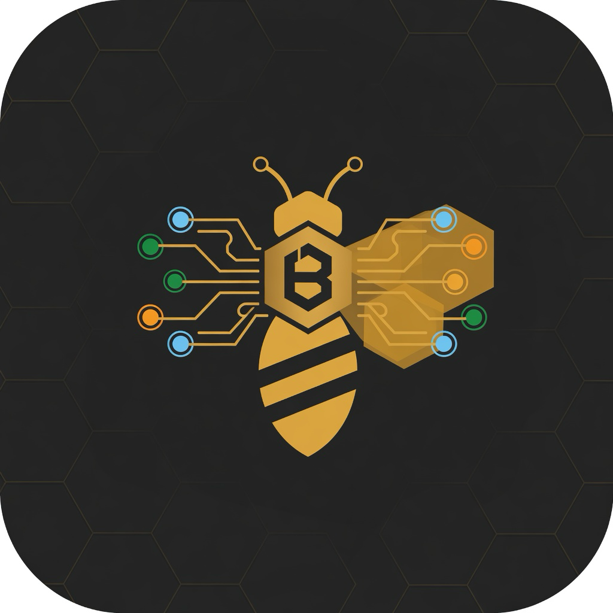

<div align="center">
  

  # BeeRouter

  **Golden-bee gateway for many AI providers.**  
  One local OpenAI-compatible endpoint. Route Claude Code, Codex, Cursor, Cline, OpenClaw… across 40+ upstreams. Combo fallback, quota tracking, RTK token saver.

  [](https://www.npmjs.com/package/@tonamson2/bee-router)
  [](./LICENSE)
  [](https://hub.docker.com/r/tonamson/bee-router)

  [Quick start](#quick-start) · [How it works](#how-it-works) · [CLI](#cli) · [Providers](#providers) · [API](#api) · [Docs](./gitbook/content/en/index.md) · [Tiếng Việt](./i18n/README.vi.md)

  
</div>

---

## What this is

BeeRouter is a **local AI routing hive** (Next.js dashboard + gateway). Clients talk to one base URL:

```
http://localhost:20128/v1
```

BeeRouter translates formats, picks an account, applies combo fallback, refreshes OAuth, and streams the reply. Data stays on disk under `~/.bee-router` unless you set `DATA_DIR`.

This repo is a fork of [decolua/9router](https://github.com/decolua/9router), rebranded and published as **`@tonamson2/bee-router`**. Upstream cloud sync still uses `https://9router.com` if you enable it.

| Artifact | Package | Role |
| --- | --- | --- |
| CLI | [`@tonamson2/bee-router`](https://www.npmjs.com/package/@tonamson2/bee-router) | Install, start, tray |
| App | `bee-router-app` (this repo, private) | Dashboard + `/v1` gateway |

---

## Quick start

```bash
npm i -g @tonamson2/bee-router
bee-router
```

Dashboard: [http://localhost:20128](http://localhost:20128) · API: `http://localhost:20128/v1`

1. **Providers** → connect something free (Kiro or OpenCode Free) or OAuth (Claude Code / Codex).
2. Point your tool at BeeRouter:

```
Endpoint:  http://localhost:20128/v1
API key:   (copy from Dashboard → Endpoint)
Model:     kr/claude-sonnet-4.5
```

```bash
npx @tonamson2/bee-router      # no global install
bee-router --port 8080
bee-router --no-browser
bee-router --skip-update
bee-router --help
```

### Docker

```bash
docker run -d --name bee-router -p 20128:20128 \
  -v "$HOME/.bee-router:/app/data" -e DATA_DIR=/app/data \
  tonamson/bee-router:latest
```

Image also on GHCR: `ghcr.io/tonamson/bee-router`. See [DOCKER.md](./DOCKER.md).

### From source

```bash
git clone https://github.com/tonamson/bee-router.git
cd bee-router
cp .env.example .env          # set JWT_SECRET + INITIAL_PASSWORD
npm install
PORT=20128 NEXT_PUBLIC_BASE_URL=http://localhost:20128 npm run dev
```

Production:

```bash
npm run build
PORT=20128 HOSTNAME=0.0.0.0 NEXT_PUBLIC_BASE_URL=http://localhost:20128 npm run start
```

Default listen port in `package.json` scripts is **20127** (webpack/dev). Production / CLI default is **20128**.

---

## How it works

```
Your CLI / IDE
      │  OpenAI or Anthropic shape
      ▼
BeeRouter  :20128/v1
  RTK compress tool_result (fail-open)
  combo expand → pick account
  translate → executor → upstream
  quota + usage log
      │
      ├─ subscription  (Claude Code, Codex, Copilot…)
      ├─ cheap         (GLM, MiniMax, Kimi…)
      └─ free          (Kiro, OpenCode Free, Vertex credits…)
```

Engine lives in `open-sse/`. App glue in `src/sse/` and `src/app/api/v1/`. Architecture: [docs/ARCHITECTURE.md](./docs/ARCHITECTURE.md).

---

## CLI tools

Any client that accepts a custom OpenAI or Anthropic base URL works.

Claude Code · Codex · OpenClaw · OpenCode · Cursor · Antigravity · Cline · Continue · Roo · Copilot · Kilo · Droid · Grok Build · Devin CLI · DeepSeek TUI · Qwen Code · jcode

Dashboard → **CLI Tools** can write settings for most of these.

---

## Providers

**OAuth:** Claude Code, Codex, GitHub Copilot, Cursor, Antigravity, Kimchi.

**Free-ish:** Kiro (credits), OpenCode Free (no auth; catalog moves), Vertex AI (new-GCP credits — use the Vertex Studio endpoint).

**API key (40+):** OpenRouter, OpenAI, Anthropic, Gemini, GLM, Kimi, MiniMax, DeepSeek, Groq, xAI, Mistral, Perplexity, Together, Fireworks, Cerebras, Cohere, NVIDIA, SiliconFlow, plus custom OpenAI/Anthropic-compatible bases.

**Self-hosted:** STT / TTS / embeddings on your machine (`providerSpecificData.baseUrl`). Embedding has **no** silent fallback to `api.openai.com`.

Connect in Dashboard → Providers. Combos: Dashboard → Combos (subscription → cheap → free).

---

## Features

| | |
| --- | --- |
| **RTK** | Compress `tool_result` (git diff, grep, ls…) before the model. Fail-open. Default on. Header `x-bee-router-token-saver: off` skips one request. |
| **Combos** | Ordered model list. Next hop on quota / 429 / hard error. |
| **Multi-account** | Several logins per provider; round-robin or priority. |
| **Translation** | OpenAI ↔ Claude ↔ Gemini ↔ Cursor ↔ Kiro ↔ Vertex ↔ … |
| **Quota** | Live windows + reset countdown. |
| **OAuth refresh** | Tokens renew without re-login. |
| **Token savers** | Optional Headroom proxy, Caveman / Ponytail prompt modes. |
| **Usage** | Tokens + *estimated* $ — BeeRouter never bills you. |
| **Cloud sync** | Optional; `CLOUD_URL` default is upstream `https://9router.com`. |

---

## Data & env

| Platform | Default dir |
| --- | --- |
| macOS / Linux | `~/.bee-router/` |
| Windows | `%APPDATA%\bee-router\` |
| Docker | `/app/data` (`DATA_DIR`) |

SQLite: `$DATA_DIR/db/data.sqlite`. Usage/logs still under `~/.bee-router` when `DATA_DIR` is set (same as upstream).

| Variable | Default | |
| --- | --- | --- |
| `PORT` | `20128` | Listen port |
| `JWT_SECRET` | generated | Dashboard session |
| `INITIAL_PASSWORD` | `123456` | **Change this** |
| `DATA_DIR` | `~/.bee-router` | App DB |
| `API_KEY_SECRET` | — | Hash gateway keys |
| `REQUIRE_API_KEY` | `false` | Force `/v1` auth |
| `BASE_URL` | instance URL | Sync callbacks |
| `CLOUD_URL` | `https://9router.com` | Optional cloud |
| `ENABLE_REQUEST_LOGS` | `false` | Debug bodies |

Full contract: [`.env.example`](./.env.example).

---

## API

OpenAI-shaped. Auth: `Authorization: Bearer <dashboard-api-key>` when keys are on.

```bash
curl http://localhost:20128/v1/models

curl http://localhost:20128/v1/chat/completions \
  -H "Authorization: Bearer $BEE_ROUTER_KEY" \
  -H "Content-Type: application/json" \
  -d '{"model":"kr/claude-sonnet-4.5","messages":[{"role":"user","content":"hi"}]}'
```

Also: `/v1/messages` (Anthropic), `/v1/embeddings`, `/v1/images/generations`, `/v1/audio/speech`, `/v1/audio/transcriptions`, `/v1/search`, `/v1/web/fetch`. Agent skills: [`skills/`](./skills).

---

## Wire a client

**Claude Code**

```bash
export ANTHROPIC_BASE_URL=http://localhost:20128
export ANTHROPIC_API_KEY=<key>
```

**Codex / OpenAI SDK**

```bash
export OPENAI_BASE_URL=http://localhost:20128/v1
export OPENAI_API_KEY=<key>
```

**Cursor:** cloud-only outbound — tunnel BeeRouter (`cloudflared` / Tailscale) or use a public URL. Localhost is ignored.

More: [gitbook/content/en/integration](./gitbook/content/en/integration).

---

## Develop

```bash
npm install
PORT=20128 NEXT_PUBLIC_BASE_URL=http://localhost:20128 npm run dev
npx eslint .
```

Tests (separate package; not all-green on a cold checkout):

```bash
cd tests && npm install
npx vitest run
# regressions: tests/__baseline__/verify-*.mjs
```

CLI pack: `npm run cli:pack`. Sync upstream: `npm run sync:upstream` → `decolua/9router`.

---

## Support

- Issues: [github.com/tonamson/bee-router/issues](https://github.com/tonamson/bee-router/issues)
- Upstream: [decolua/9router](https://github.com/decolua/9router)

Thanks: [CLIProxyAPI](https://github.com/router-for-me/CLIProxyAPI), [RTK](https://github.com/rtk-ai/rtk), [Caveman](https://github.com/JuliusBrussee/caveman), [Ponytail](https://github.com/DietrichGebert/ponytail), [Headroom](https://github.com/chopratejas/headroom).

## License

[MIT](./LICENSE)
